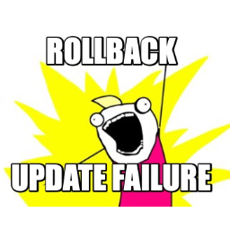

# Rollback Auto Update

* Plugin Name: Rollback Auto Update
* Contributors: afragen, costdev, pbiron
* Tags: feature plugin, update, failure, auto-update
* License: MIT
* Requires PHP: 7.0
* Requires at least: 6.3
* Stable Tag: main

A feature plugin now only for testing Rollback Auto Update, aka Rollback part 3. Manual Rollback of update failures has been committed in WordPress 6.3.

## Description

This is a feature plugin is for testing Rollback Auto-Update, aka Rollback part 3. This feature only protects plugins during the auto-update process.

As part of the normal Rollback process, the currently installed version of the plugin is moved to `wp-content/upgrade-temp-backup/plugins`. An active plugin is checked to ensure it doesn't cause a PHP fatal error when visiting the site. An inactive plugin is not checked because it cannot cause your site to white screen.

Rollback parts 1 was merged into WordPress 6.2 as the `move_dir()`. Rollback part 2 was merged into WordPress 6.3 and protects the manual update process of plugins and themes.

* [r53578](https://core.trac.wordpress.org/changeset/53578) 
* [r55204](https://core.trac.wordpress.org/changeset/55204)
* [r55219](https://core.trac.wordpress.org/changeset/55219)
* [r55220](https://core.trac.wordpress.org/changeset/55220) 
* [r55223](https://core.trac.wordpress.org/changeset/55223)
* [r55720](https://core.trac.wordpress.org/changeset/55720)

## Testing

* Requires WordPress 6.3
* This **only** works on auto-updates.
* Run the following commands from the terminal. You might need to run the command several times to get it started:
<code>wp cron event run wp_version_check</code>
* When updating a plugin, you should be able to see the old plugin in the `wp-content/upgrade-temp-backup/plugins/PLUGINNAME` folder. The same should apply for themes. Since updates sometimes run fast and we may miss the folder creation during testing, you can simulate an update failure to demonstrate.
* When a plugin auto-update fails, the previous version should be restored. To test that, change the version of a plugin to a previous number, run the update, and on fail the previous version (the one where you changed the version number) should still be installed on the site. To simulate an update failure and confirm this works, use the built-in **Simulate failure** link. Just activate/deactivate from the `plugins.php` page action link. This link will only be present if the plugin has an update pending.

## Reporting

Please submit [issues](https://github.com/afragen/rollback-update-failure/issues) and [PRs](https://github.com/afragen/rollback-update-failure/pulls) to GitHub.

Logo from a meme generator. [Original artwork](http://hyperboleandahalf.blogspot.com/2010/06/this-is-why-ill-never-be-adult.html) by Allie Brosh.

## Changelog

Please see the Github repository: [CHANGELOG.md](https://github.com/afragen/rollback-update-failure/blob/main/CHANGELOG.md).
